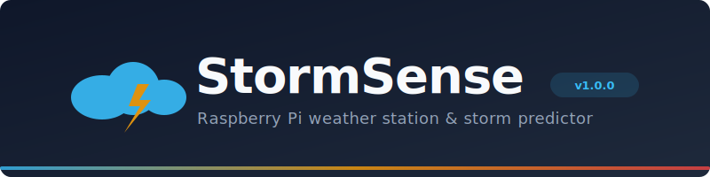

<p align="center">
  
</p>

<p align="center">
  <a href="LICENSE"></a>
  
  
  
  
</p>

---

**StormSense** is a self-contained weather station and storm predictor built on a **Raspberry Pi + Rainbow HAT**. It reads barometric pressure and temperature from the onboard BMP280 sensor, tracks pressure trends over a 3-hour rolling window, and alerts you when storms are approaching — via the HAT's display, LEDs, buzzer, and a **Flutter companion app**.

## Features

- **Real-time monitoring** — Temperature and barometric pressure updated every 5 seconds
- **Storm detection** — Automatic storm level classification (Clear / Watch / Warning / Severe) based on 3-hour pressure delta
- **Rainbow HAT display** — Current readings on the 14-segment display, storm severity on the LED rainbow arc, buzzer alerts on escalation
- **Hardware buttons** — Button A (temperature), Button B (pressure), Button C (storm level / reset)
- **Flutter companion app** — Live dashboard, 24-hour pressure history charts, storm push notifications
- **REST API** — Simple JSON API for integrations and home automation
- **Local-only** — All data stays on your network. No cloud. No accounts. No telemetry.

## Architecture

```
┌──────────────────────────────────────────────────────┐
│              Raspberry Pi 3B + Rainbow HAT           │
│                                                      │
│  ┌────────────────┐    ┌────────────────────┐        │
│  │ SensorService  │───►│ HATInterface       │        │
│  │ BMP280 reading │    │ Display / LEDs /   │        │
│  │ Storm engine   │    │ Buttons / Buzzer   │        │
│  └───────┬────────┘    └────────────────────┘        │
│          │                                           │
│  ┌───────▼────────┐                                  │
│  │ Flask REST API  │                                 │
│  │ :5000/api/*     │                                 │
│  └───────┬─────────┘                                 │
└──────────┼───────────────────────────────────────────┘
           │ WiFi (HTTP)
           ▼
┌──────────────────────────────────────────────────────┐
│                   Flutter App                        │
│                                                      │
│  ┌───────────┐ ┌───────────┐ ┌────────────────────┐ │
│  │ Dashboard │ │  History  │ │     Settings       │ │
│  │ Live data │ │ 24h chart │ │ Units / Polling    │ │
│  └───────────┘ └───────────┘ └────────────────────┘ │
│                                                      │
│  ┌───────────────────────────────────────────────┐   │
│  │ Storm Notifications (local push)              │   │
│  └───────────────────────────────────────────────┘   │
└──────────────────────────────────────────────────────┘
```

## Quick Start

### Raspberry Pi Setup

**Hardware:** Raspberry Pi 3B (or newer) with a [Pimoroni Rainbow HAT](https://shop.pimoroni.com/products/rainbow-hat)

```bash
# Clone the repo
git clone https://github.com/nickdemari/stormsense.git
cd stormsense/stormsense-pi

# Install dependencies
pip install -r requirements.txt

# Run it
python -m storm_sense.main
```

The API server starts on port `5000`. Test it:

```bash
curl http://<pi-ip>:5000/api/status
curl http://<pi-ip>:5000/api/history
curl http://<pi-ip>:5000/api/health
```

**Run on boot** (optional):

```bash
sudo cp stormsense.service /etc/systemd/system/
sudo systemctl enable stormsense
sudo systemctl start stormsense
```

See [Rainbow HAT Setup Guide](docs/rainbow-hat-setup.md) for detailed hardware instructions.

### Flutter App Setup

**Requires:** Flutter SDK 3.11+

```bash
cd storm_sense

# Install dependencies
flutter pub get

# Generate Freezed models
dart run build_runner build --delete-conflicting-outputs

# Run the app
flutter run
```

On first launch, enter your Pi's IP address to connect.

## API Reference

### `GET /api/status`

Returns current sensor readings and storm level.

```json
{
  "temperature": 23.45,
  "raw_temperature": 28.12,
  "pressure": 1013.25,
  "storm_level": 0,
  "storm_label": "CLEAR",
  "samples_collected": 42,
  "history_full": false,
  "display_mode": "TEMPERATURE",
  "pressure_delta_3h": -1.2
}
```

### `GET /api/history`

Returns up to 24 hours of readings, oldest first.

```json
[
  {
    "timestamp": 1708635600.0,
    "temperature": 23.45,
    "raw_temperature": 28.12,
    "pressure": 1013.25,
    "storm_level": 0
  }
]
```

### `GET /api/health`

```json
{
  "status": "ok",
  "uptime_samples": 42
}
```

## Storm Detection

StormSense classifies storm severity based on the barometric pressure change over a 3-hour rolling window:

| Level | Pressure Delta (3h) | HAT LEDs | Buzzer |
|-------|---------------------|----------|--------|
| **Clear** | > -3.0 hPa | All green | None |
| **Watch** | -3.0 to -6.0 hPa | Green + Yellow | Single tone |
| **Warning** | -6.0 to -10.0 hPa | Green + Yellow + Orange | Triple beep |
| **Severe** | < -10.0 hPa | All red | Triple beep |

## Project Structure

```
stormsense/
├── stormsense-pi/           # Raspberry Pi Python service
│   ├── storm_sense/
│   │   ├── main.py          # Entry point + orchestration
│   │   ├── sensor_service.py# BMP280 reading + storm detection
│   │   ├── hat_interface.py # Rainbow HAT display/LEDs/buttons
│   │   ├── api_server.py    # Flask REST API
│   │   └── config.py        # Shared constants + thresholds
│   ├── tests/               # pytest test suite
│   ├── requirements.txt
│   └── stormsense.service   # systemd unit file
│
├── storm_sense/             # Flutter companion app
│   ├── lib/
│   │   ├── core/            # API client, models, theme
│   │   ├── features/        # BLoC features (dashboard, history, settings)
│   │   └── notifications/   # Local push notification service
│   ├── test/                # Flutter test suite
│   └── pubspec.yaml
│
└── docs/                    # Documentation + design references
```

## Screenshots

<!-- Add your app screenshots here -->
<p align="center">
  <i>Screenshots coming soon — contributions welcome!</i>
</p>

## Contributing

Contributions are welcome! See [CONTRIBUTING.md](CONTRIBUTING.md) for development setup and guidelines.

## License

[MIT](LICENSE) &copy; 2025-2026 Nick DeMari
